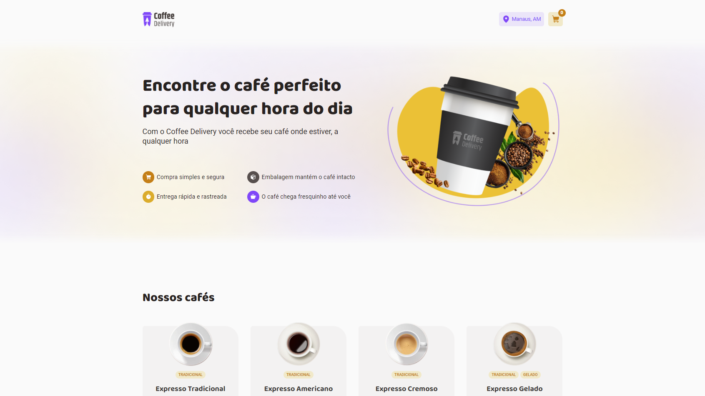
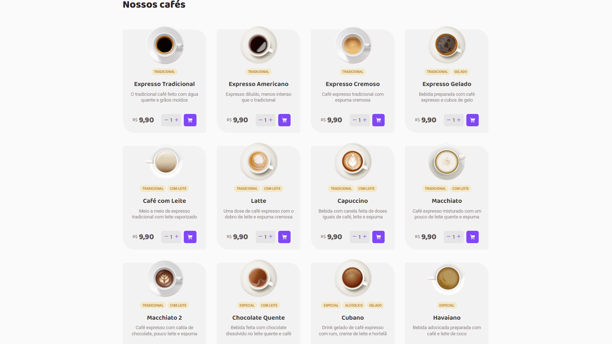
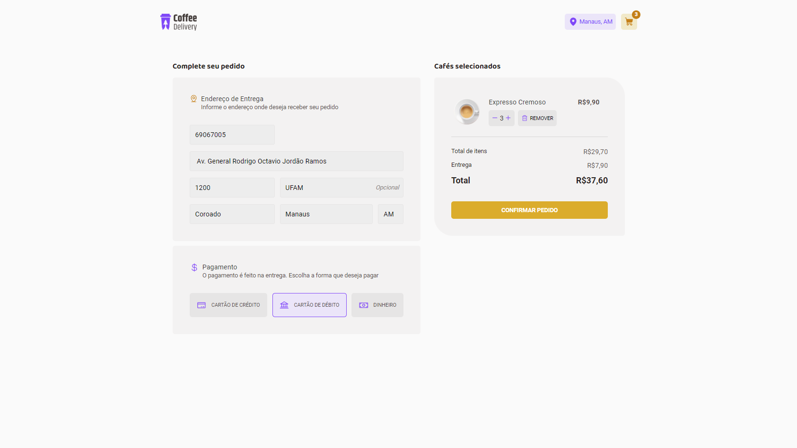
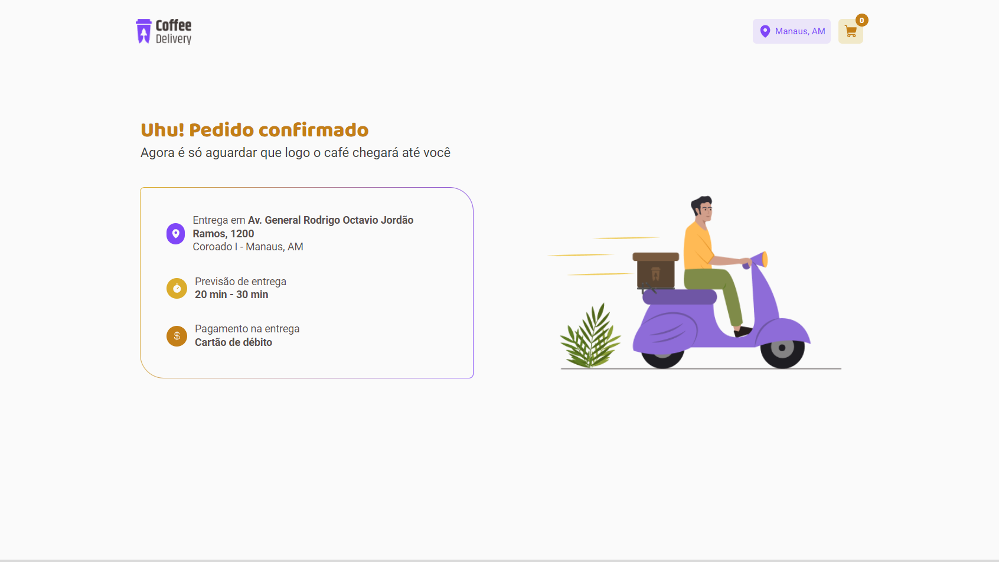

<h1 align="center" style="text-align: center;">
  Coffee Delivery :coffee:
</h1>

> Loja online de cafés

<p align="center">
  <a href="#project">Projeto</a>&nbsp;&nbsp;&nbsp;|&nbsp;&nbsp;&nbsp;
  <a href="#layout">Layout</a>&nbsp;&nbsp;&nbsp;|&nbsp;&nbsp;&nbsp;
  <a href="#technologies">Tecnologias</a>&nbsp;&nbsp;&nbsp;|&nbsp;&nbsp;&nbsp;
  <a href="#usage">Utilização</a>&nbsp;&nbsp;&nbsp;|&nbsp;&nbsp;&nbsp;
  <a href="#license">Licença</a>
</p>

<p align="center">
  
</p>

<h2 id="project">📁 Projeto</h2>

Loja online de cafés com a opção de delivery, onde o usuário adiciona ao carrinho de compras um ou mais dos produtos disponíveis e solicita a compra preenchendo o formulário com o endereço de entrega e forma de pagamento.

O projeto inclui várias funcionalidades, como navegação entre páginas com React Router DOM, uso de formulários gerenciados pelo React Hook Form, validação de formulários com a biblioteca Zod, utilização da Context API para gerenciamento de estado, utilização de layout padrão para a aplicação, entre outras.

Créditos: esta aplicação foi desenvolvida como conclusão de um dos diversos desafios do treinamento Ignite da Rocketseat. O projeto foi desenvolvido do total zero, apenas seguindo o layout proposto pela rocketseat na plataforma do [Figma](https://www.figma.com/file/2TktBsxzBlrsXwM7bVl6hm/Coffee-Delivery).

<h2 id="layout">🎨 Layout</h2>

A aplicação conta com as seguintes páginas:

- Home





- Checkout
 


- Success




<h2 id="technologies">💻 Tecnologias</h2>

Este projeto foi desenvolvido com as seguintes tecnologias:

- Typescript
- ReactJS
- ViteJS
- Context API
- React Router DOM
- Styled Components
- React Hook Form
- Zod
- Immer

<h2 id="usage">💡 Utilização</h2>

A aplicação Coffee Delivery está disponível para uso [aqui](https://coffee-delivery-frontend.netlify.app/).

Você também pode executá-la em sua máquina localmente. Certifique-se de ter o ``Node.js`` e o ``npm`` instalados antes de prosseguir com as etapas abaixo:

1. Clone o projeto:

```
$ git clone https://github.com/mfernandanll/coffee-delivery
```

2. Acesse a pasta do projeto:

```
$ cd coffee-delivery
```

3. Instale as dependências:

```
$ npm install
```

4. Inicie o servidor do frontend:

```
$ npm run dev
```

5. O terminal irá exibir o endereço local onde a aplicação está sendo executada. Basta digitar o mesmo endereço em seu navegador preferido. O endereço usado na criação do projeto foi este:
 
```
  http://localhost:5173/
```


<h2 id="license">📝 Licença</h2>

Este projeto está sob a licença MIT.

---

Made with ❤ by Fernanda Loureiro 👋 [Get in Touch!](https://www.linkedin.com/in/maria-fernanda-loureiro/)
